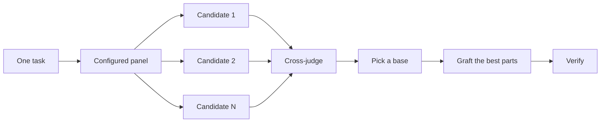

# Design before you write code

One attempt at a hard design locks in the first shape the model thought of. `/architect` settles types and boundaries before implementation. `/arena` runs several attempts at the same brief and merges the best parts. `/interrogate` has other models try to break the result. When the job is coverage rather than design synthesis, `/swarm` fans out slices or races and aggregates their results.

The two most common design mistakes are taking the agent's first design and polishing a plan that no code has tested. This page fixes both. You plan through code: prototypes answer the open questions, a README or tutorial sets the target, and the written plan comes last.


## Settle the shape with `/architect`

```text
/architect design the import pipeline before writing any code. i care most about how callers use it.
```

[`/architect`](../../skills/architect/SKILL.md) grounds itself first, running `/how` over the code the design touches and `/why` when it moves ownership or layers. Then it runs `/arena` to produce competing design sketches, with the caller's usage written first in each, followed by types, signatures, and a module map.

By default it proceeds straight from the synthesized design into implementation. If you want to see the design first, say so:

```text
/architect with checkpoint. stop and show me before implementing.
```

The design isn't sacred once code starts. If implementation shows the same workaround in unrelated places, or types that only compile with `any` or forced casts, `/architect` treats that as proof the design is wrong. It scraps the sketch and starts over instead of patching around it.

## Fan out attempts with `/arena`

```text
/arena take my prompt to the arena verbatim. i want to compare their proposals with yours.
```

[`/arena`](../../skills/arena/SKILL.md) is the general tool underneath. N subagents attempt the same design or code brief in parallel, each writing to its own worktree or directory. A read-only judge, on a different model family when your configuration allows one, scores every candidate against a rubric. The coordinator reads each candidate end to end, picks a base, grafts in the best ideas from the losers, and verifies the result.



The panel comes from your [`/setup-pstack`](../../skills/setup-pstack/SKILL.md) configuration, and you can adjust it per task. Ask for more candidates when the decision matters, fewer when it doesn't:

```text
/arena this, 5 candidates. the cache key format is expensive to change later.
```

## Cover slices and races with `/swarm`

```text
/swarm check every package under packages/ against its check.sh. one worker per package. one report.
```

[`/swarm`](../../skills/swarm/SKILL.md) fans N workers across independent slices, coverage matrices, gauntlet lanes, exploration partitions, or declared race arms. Each worker gets its own scope and check, then reports `PASS`, `ISSUES`, or `BLOCKED`. The parent waits for the workers and returns one compact report with any gaps or dropouts.

Reach for it when parallelism buys coverage or lets independent checks race. `/arena` gives every worker the same design or code brief, then picks a base and grafts the best parts. `/swarm` covers slices or runs a race with a selection rule declared up front. It does not use the base-selection and grafting ceremony.

## Break it with `/interrogate`

```text
/interrogate the whole branch, but skeptically. no nitpicks unless it's an actual bug or regression.
```

[`/interrogate`](../../skills/interrogate/SKILL.md) sends the same diff, intent, and rubric to reviewers on different model families. Model diversity is the point. Different models have different blind spots, so a finding two models raise independently is high-confidence signal. The lead sorts everything into `Act on`, `Consider`, `Noted`, and `Dismissed`, with a reason for each dismissal, and applies nothing automatically.

Read the dismissals too. The lead is a pragmatic senior engineer, not an oracle, and you can override it.

## Prototype instead of debating

Never take the first design. Ask for a few, and pick from evidence you can see:

```text
/poteto-mode prototype a few options for the new dropdown menu. take screenshots or videos for me to compare.
```

The [Prototype playbook](../../skills/poteto-mode/playbooks/prototype.md) builds throwaway sketches in a scratch directory, puts the variants behind one switcher, drives each one, and captures screenshots or timings. It also works for behavior and algorithms, not just UI. Prototypes are planning with code. They let the agent answer its own open questions by running something instead of asking you, and they leave room for an option you wouldn't have thought of.

The same idea scales up to a real design. Pair `/architect` with prototypes and keep a review gate:

```text
/poteto-mode we need rate limiting for external webhooks. /architect it first, and answer open questions with prototypes. let me review before proceeding.
```

Don't spend reviewers on an abstract plan. `/interrogate` belongs on a diff. Point adversarial review at a plan with no code behind it and the reviewers invent theoretical risks and edge cases that will never happen. Let prototypes settle the questions, then review what got built.

## Write the README first for shared code

For a package or API that other code will use, start with the doc a user would read:

```text
/poteto-mode write a tutorial for how i would use the new config package first. then /teach me why it beats the current one.
```

Writing the tutorial first forces the caller's view. You describe the API to a hypothetical user and work back to the implementation. The doc also becomes a concrete target the agent checks its own work against. Name [`/technical-writing`](../../skills/technical-writing/SKILL.md) when the doc itself matters, so a tutorial stays a tutorial instead of drifting into reference and explanation at once.

## Plan after the design settles

pstack has no planning skill, on purpose. When you do want a written plan, ask for it once the design is settled:

```text
/poteto-mode turn this design into a plan. small verifiable PRs, each with its own verification steps.
```

The [Multi-phase plan playbook](../../skills/poteto-mode/playbooks/multi-phase-plan.md) settles any remaining open questions by prototype, then writes one section per PR, each ending in proof that the change works. A passing test suite alone doesn't count as that proof. The plan is the deliverable. The playbook doesn't implement it, and it names which execution playbook should run it next.

For a migration, state the bar in the prompt:

```text
/poteto-mode plan the migration of our ui library to the new styling system. small verifiable PRs, each with visual regression checks. the result must match the original exactly, bugs included.
```

"bugs included" keeps the migration from quietly fixing things on the way, which would make the old and new output impossible to compare. For a project that spans many days, you can commit the plan to the repo for a while so other agents see the work in progress. Delete it when the work lands.

## How much design work does a task deserve?

You might be wondering whether every change needs this. No. Most changes need none of it. A rough ladder:

- A small, finished change you're unsure about needs `/interrogate` alone.
- A change that crosses function boundaries or moves ownership earns `/architect`, which brings `/arena` with it.
- A standalone decision where independent attempts would help, like naming, formats, or an algorithm, is `/arena` directly.
- A coverage matrix, set of parallel checks, or race with declared arms is `/swarm`.
- An open question you could answer by running something, like a layout, a timing, or an approach, gets a prototype, not a debate.
- A contested design that's expensive to reverse gets `/architect`, then `/interrogate` before shipping.
- Work that spans several PRs gets a plan, written after the design settles.

`/poteto-mode` already applies this ladder. Boundary-crossing work triggers `/architect` on its own, so you reach for these directly mainly when you want more or less scrutiny than the default.

Next: [Build and clean the change](./05-build-and-clean.md).
